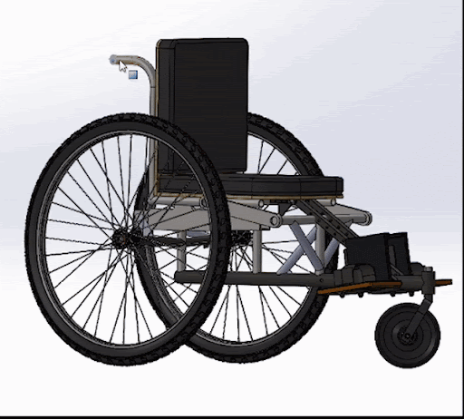

<link rel="stylesheet" href="assets/style.css">

<h1 class="manual-header">Design Features and Rationale</h1>

The detailed design rationale, including design decisions, calculations, evidence, and supporting documentation, has been consolidated into a comprehensive **White Paper**. This document provides an in-depth explanation of the Tilt-In-Space Wheelchair's design features, ensuring clarity and transparency in the decision-making process.

---

## Access the Full Design Rationale

To view the full white paper outlining the design features, rationale, and evidence:

**[🔗 Click here to access the Tilt-In-Space Wheelchair Design Rationale (Google Doc)](https://docs.google.com/document/d/1TS_quRtzBsa6iBTKbUMOw3JwEazzCW9Is7TqMeRp_rw/edit?usp=sharing)**  

<h1 class="manual-header">CAD of Tilt-In-Space Wheelchair</h1>

    

**[🔗 Click here to access the Tilt-In-Space Wheelchair CAD (Solidworks)](https://drive.google.com/drive/folders/1JV4eCSn2WF48jZmelW2elhDNQEG-zBg-?usp=sharing)** 
