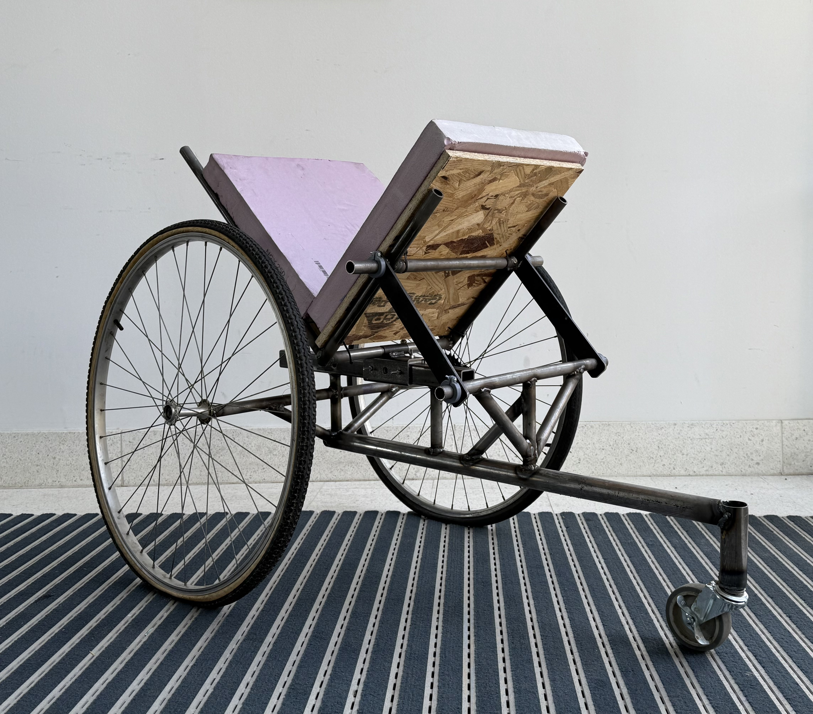
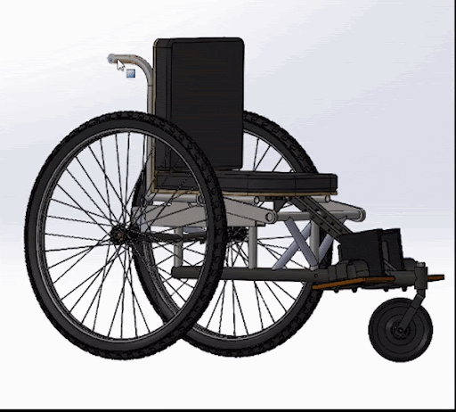
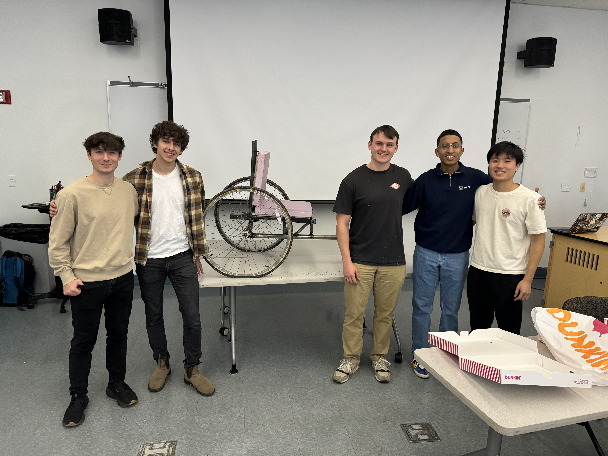

<link rel="stylesheet" href="assets/style.css">

<!-- Header -->
<h1 class="manual-header">Tilt-In-Space Wheelchair Project</h1>
**By: Alton Coolidge, Charith Fernando, Kenta Terasaki Mateo Brancoli, and Matt Farmar** 

  

    

Welcome to the project page for the **Tilt-In-Space Wheelchair** for Kyaro Assistive Technologies. 

The Tilt-In-Space wheelchair technology significantly improves comfort and quality of life for individuals with contractures or spinal deformities. By allowing them to adjust their seating position, this innovation helps reduce pressure sores and alleviate discomfort, enabling users to remain in their wheelchairs for extended periods. For example, in the past, individuals may have needed to leave their wheelchairs for activities such as reclining to relieve back pain or repositioning to prevent pressure ulcers. 

Current designs cost over $2000 and use complicated systems such as pneumatics. Our goal was to dramatically reduce the cost for making tilt-in-space wheelchairs that can also be sourced and manufactured entirely in Tanzania, where Kyaro runs out of. Spoiler Alert: We were able to make a working tilt-in-space wheelchair that costs $47.55! We hope to use our developed mechanism and prototype in order develop a new line of products at Kyaro to make tilt-in-space wheelchairs accessable to anyone in need. 

---

## Team Photo!
  

---

## Explore the Project
- [Photos and Videos](photos.md)
- [Requirements](requirements.md)
- [Subsystems](architecture.md)
- [Design Rationale](design.md)
- [Bill of Materials](bom.md)
- [Future Work](conclusion.md)
